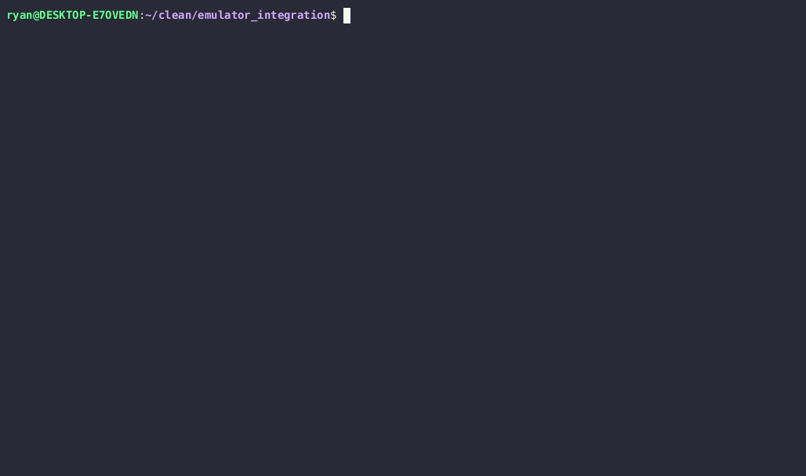

# Samsung Galaxy S5 Firmware Emulator
This project presents a proof-of-concept firmware emulator built upon the Qiling framework, specifically designed for the Samsung Galaxy S5, which is powered by the Qualcomm MSM8974 System-on-Chip. I selected this device due to my years of research experience with it.

Several hardware peripherals and features are supported, such as the SDHCI controller/eMMC card, interrupts, system timer, GPIO, UART, security controller/eFuse, PMIC, TrustZone, and the crypto engine (currently limited to SHA256).

In the near future, I plan to incorporate a fuzzing example as a proof-of-concept demonstration, leveraging Unicorn AFL++ support available in the Qiling framework.

## Little Kernel (aboot or Android bootloader)

## Debug mode (Exposing MMIO emulation)
